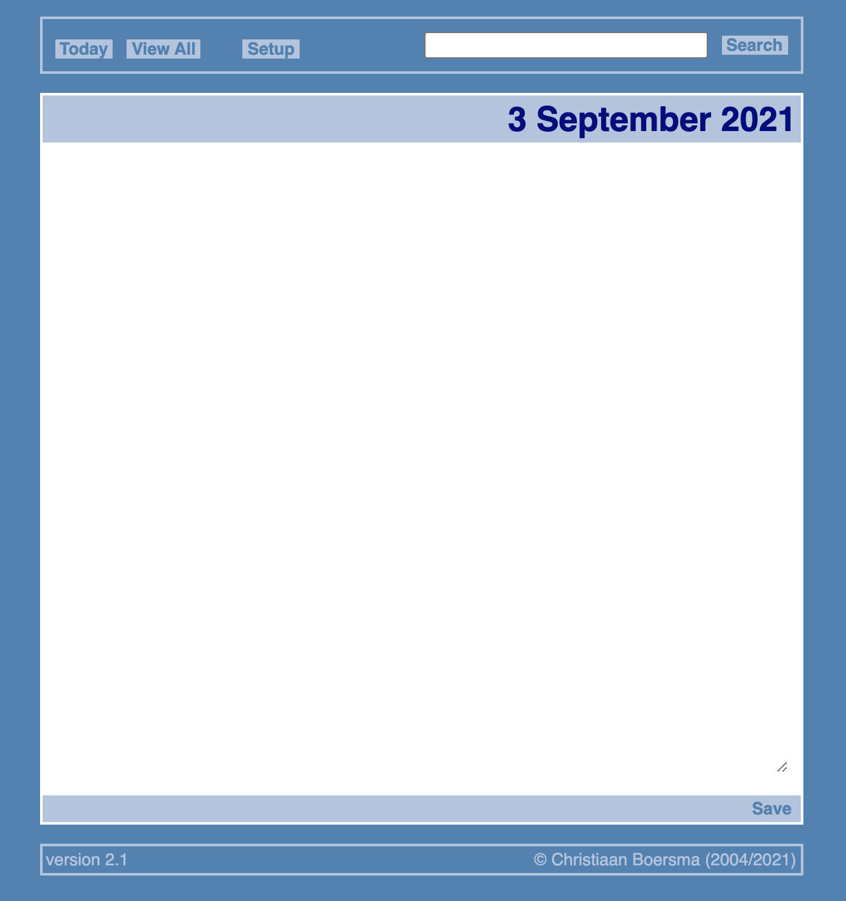

# Logger

`Logger` helps you keep a daily online log. It is written in C++ and relies on the [Common Gateway Interface](https://en.wikipedia.org/wiki/Common_Gateway_Interface) (`CGI`) for communication with its webserver. The look of `Logger` is theme-able, with a number of themes included by default.



## Usage

Building `Logger` requires the following:

1. `C++` compiler
2. `make`

The web application is build with:

```shell
make
```

This produces a file named `index.cgi`. The entire `Logger` directory should be moved into your webserver's root directory. Using a web browser you can then navigate to:

```shell
http://localhost/Logger/index.cgi
```

and start using the application.

## Theming

`Logger` uses Cascading Stylesheet (`css`) theming. A number of themes are provided in the [themes](themes)-directory, which is a good place to start doing your own theming.

## Notes

1. You can use `HTML` to format your entries.

## BSD-3 License

Redistribution and use in source and binary forms, with or without modification, are permitted provided that the following conditions are met:

1. Redistributions of source code must retain the above copyright notice, this list of conditions and the following disclaimer.

2. Redistributions in binary form must reproduce the above copyright notice, this list of conditions and the following disclaimer in the documentation and/or other materials provided with the distribution.

3. Neither the name of the copyright holder nor the names of its contributors may be used to endorse or promote products derived from this software without specific prior written permission.

THIS SOFTWARE IS PROVIDED BY THE COPYRIGHT HOLDERS AND CONTRIBUTORS "AS IS" AND ANY EXPRESS OR IMPLIED WARRANTIES, INCLUDING, BUT NOT LIMITED TO, THE IMPLIED WARRANTIES OF MERCHANTABILITY AND FITNESS FOR A PARTICULAR PURPOSE ARE DISCLAIMED. IN NO EVENT SHALL THE COPYRIGHT HOLDER OR CONTRIBUTORS BE LIABLE FOR ANY DIRECT, INDIRECT, INCIDENTAL, SPECIAL, EXEMPLARY, OR CONSEQUENTIAL DAMAGES (INCLUDING, BUT NOT LIMITED TO, PROCUREMENT OF SUBSTITUTE GOODS OR SERVICES; LOSS OF USE, DATA, OR PROFITS; OR BUSINESS INTERRUPTION) HOWEVER CAUSED AND ON ANY THEORY OF LIABILITY, WHETHER IN CONTRACT, STRICT LIABILITY, OR TORT (INCLUDING NEGLIGENCE OR OTHERWISE) ARISING IN ANY WAY OUT OF THE USE OF THIS SOFTWARE, EVEN IF ADVISED OF THE POSSIBILITY OF SUCH DAMAGE.
